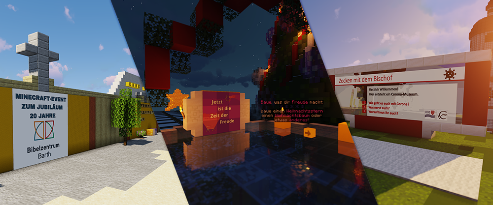

# Kooperation und Freiraum für eigene Bildungs-Angebote

## Über uns

Das Bibellabor der **von Cansteinschen Bibelanstalt in Berlin e.V.** nutzt seit 2019 den Minecraft-Server als 
mediales Mittel für kirchliche und pädagogische Bildungs-Angebote für Kinder und Jugendliche, sowie für 
Erwachsenen-Fortbildung im Bereich der Medien-Kompetenz, der Präsentation neuartiger Wege Junge Menschen für die 
Kirche zu begeistern oder Videospiele als nützliches didaktisches Mittel einzusetzen.

In all den Jahren hat sich ein Team gebildet, dass die Werte des Vereins vertritt und fortlaufend das Potenzial des 
Minecraft Server-Netzwerks ausschöpfen möchten. Canstein ist bei den Minecraft-Spielern für das Überschreiten von 
gewohnten Grenzen zwischen Lern-Umgebung, Kirche und digitaler Welt bekannt und möchte auch zukünftig bewährte Ideen 
ausbauen und Neues wagen.

## Ihr Projekt bei uns im Server-Netzwerk

Wenn Sie mit der Idee spielen für Ihre Kirchengemeinde, Arbeitsgemeinschaft, Schulklasse, Konfi-Gruppe, Verein oder die 
Teilnehmer einer Veranstaltung eigene Angebote mit **Minecraft** zu entwickeln, können wir Ihnen dabei **beratend 
zur Seite stehen und einen Platz auf unserem Minecraft-Server anbieten**. Wir haben eine ausgebaute IT-Infrastruktur,
eine Vielfalt durchdachter Tools (Sever-Plugins) für den kreativen und moderativen Einsatz, ein fähiges und 
eingespieltes Support-Team, Mitarbeiter mit jahrelangen Erfahrungen rund um die Leitung von Minecraft-Servern und 
kurze Kommunikationswege für eine zügige Realisierung Ihrer Ideen. Wir freuen uns immer wieder auf neue Projekte und 
ein lebendiges Miteinander auf dem Server-Netzwerk.

Das Einrichten eines Minecraft-Servers braucht viel Zeit, Wissen und Geld. **Zeit** zum Entwickeln des Angebots, 
klar. Aber auch Zeit zum Einrichten und Austesten aller notwendigen Standard-Plugins, IT-Systeme und 
Kommunikationswege. Zeit zum Aufbauen eines Server-Teams mit verteilten Aufgaben oder Zeit zum Bauen einladender 
Start-Regionen. Es brauch **Wissen** über die Standards von Minecraft-Servern, Grundlagen des Game-Designs oder 
Erfahrungen im Bereich der Informatik, sowie Wissen über Datenschutz und Sicherheitstechniken. Und es kostet 
**Geld** einen eigenen Server zu mieten und entsprechende Arbeitsstunden in deren Entwicklung zu investieren. Einen 
Großteil davon können wir Ihnen ersparen, ohne dass Ihre Projekt-Idee dadurch negativ beeinflusst wird. **Die Basis 
eines jeden Game-Servers steht bei uns schon bereit.**

Wir bieten Ihnen die Einrichtung der gewünschten Welten, Regionen, Ränge oder Plugins. Das Projekt soll nach Ihren 
Anforderungen bei uns vorbereitet werden und von Ihnen gestaltet werden können. Am Ende läuft es für eure Spieler 
und für die bestehenden Spieler unseres Netzwerks **unter eurem Namen und eurem Logo**. Lassen Sie uns zusammen mit 
Ihren Möglichkeiten das Beste unserer Ressourcen nutzen und eine Kooperation starten.