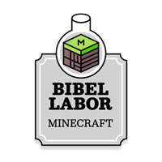
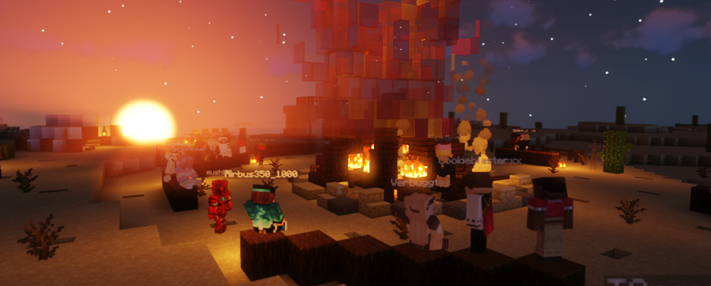

# Überblick

**Dies ist die offizielle Dokumentation zum Minecraft-Server Canstein-Berlin.de**

!!! basic-info ""

    Das Projekt ist ein Angebot des Bibellabors der **von Cansteinschen Bibelanstalt in Berlin e.V.** - einem unabhängigen, ehrenamtlichen Kirchen-Verein mit dem Ziel die Entstehung der Bibel zu vermitteln und Inhalte der Bibel verständlich und erlebbar zu machen. Auf unserem Minecraft-Server kann jeder mitspielen! Weitere Informationen über uns als Verein, findest du auf unserer Hauptseite [www.canstein-berlin.de](https://canstein-berlin.de) und hier in der Online-Doku.

## Minecraft-Server

### Minecraft Java

* Server-Adresse: `canstein-berlin.de`
* interne MC-Version: 1.21.1
* erreichbar mit: 1.17.0 - 1.21.1

### Minecraft Bedrock

* Server-Adresse: `bedrock.canstein-berlin.de`

## Über unseren Verein

* Homepage: https://canstein-berlin.de
* Wir finanzieren uns ausschließlich durch Spenden: https://canstein-berlin.de/spenden
* YouTube: https://www.youtube.com/@Bibellabor

## Social-Media

* Twitter: https://twitter.com/Bibellabor_MC
* Instagram: https://www.instagram.com/bibellabor_mc

## Kontakt

* Discord: https://www.discord.gg/9TyxfuG
* E-Mail: [kontakt@canstein-berlin.de](mailto:kontakt@canstein-berlin.de)

