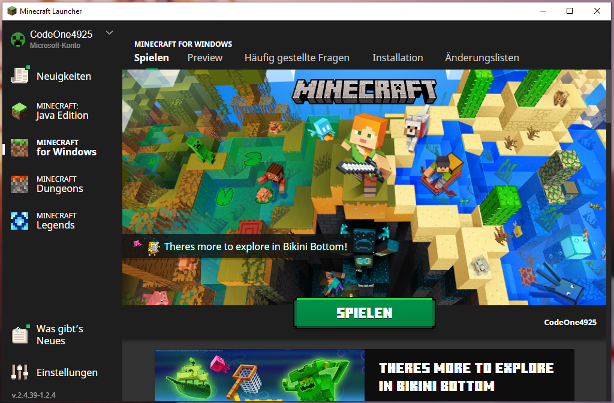
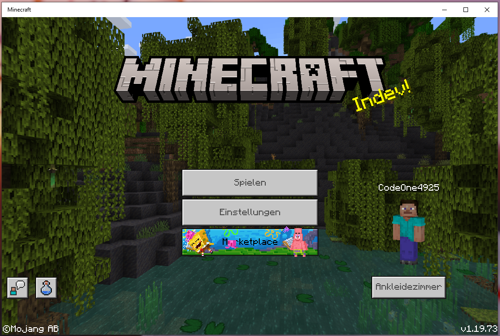
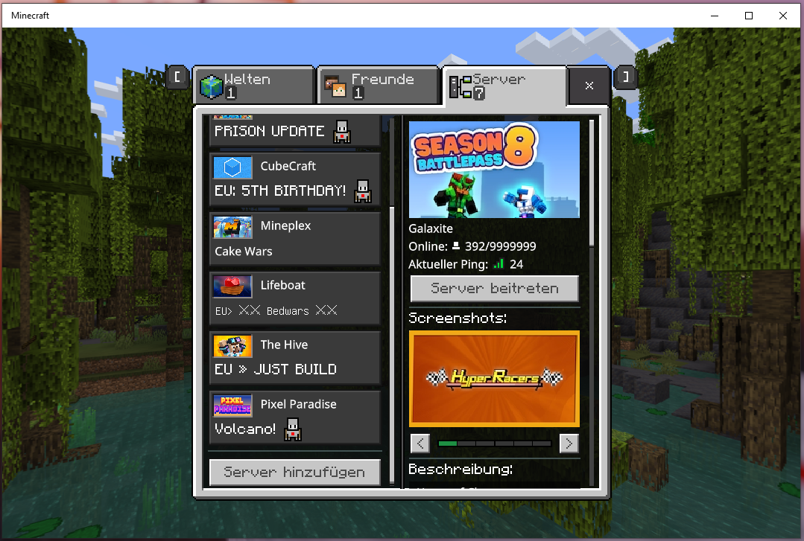
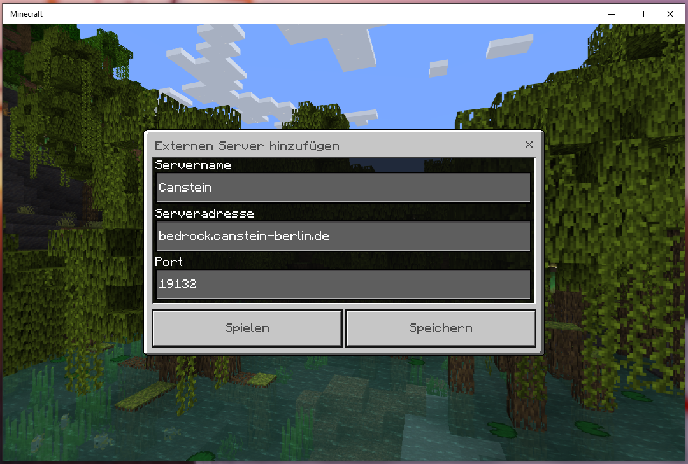
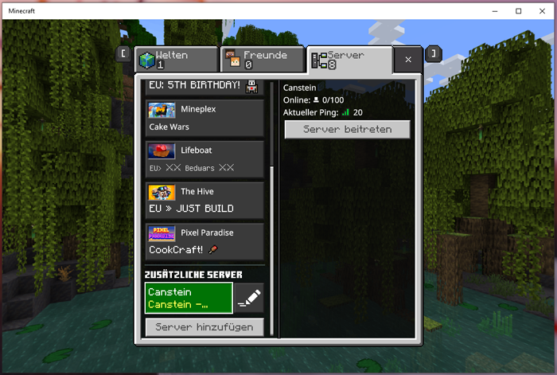

# Server betreten (MC Bedrock)
Seit diesem Jahr unterstützt unser Server-Netzwerk nun auch offiziell die **Minecraft Bedrock Edition**.

## Beitritt

### Beitritt über Windows PC

#### Schritt 1

Im Minecraft-Launcher wird links "Minecraft for Windows" ausgewählt. Nach dem Klick auf "Spielen" unten in der Mitte, startet sich nun das eigentliche Spiel.

#### Schritt 2

Nun befinden wir uns in der Bedrock-Edition von Minecraft. Eventuell wird man links zur Anmeldung mit dem Microsoft-Account aufgefordert. Wenn dies erledigt ist, klickt man auf den großen Button "Spielen".

#### Schritt 3

Ganz oben befinden sich jetzt drei Menü-Reiter. Nach dem Klick auf den dritten Reiter "Server" gelangt man in die Server-Liste. Wir möchten einen neuen Server eintragen. Dazu scrollen wir uns durch die Server-Vorschläge und klicken links unten auf den Button "Server hinzufügen".

#### Schritt 4

Hier kann der Wunsch-Server eingetragen werden. In der Zeile "Servername" kannst du einen beliebigen Namen zur Wiedererkennung wählen.

In die Zeile "Serveradresse" muss `bedrock.canstein-berlin.de` eingetragen werden und die Zeile "Port" kann mit dem Standard-Port für Bedrock gelassen werden.

#### Schritt 5

Nachdem der Server eingetragen wurde, wird er nun in der Server-Liste ganz unten bei "Zusätzliche Server" aufgelistet. Klickt man jetzt auf diesen Server-Eintrag, erhält man auf der rechten Seite die wichtigsten Informationen zum Server. Nach dem Klick auf den Button "Server betreten" kommt man schließlich auf den Server.

### Beitritt über die Switch

### Beitritt über PlayStation 4

### Beitritt über die Xbox One

## Account-Synchronisierung
Da grundsätzlich der Bedrock-Account als neuer Account gezählt wird, muss dieser erst mit dem Java-Account verlinkt / synchronisiert werden.

### Lokale Verlinkung
Die "Lokale Verlinkung" meint hiermit die Java-zu-Bedrock-Account Verlinkung ausschließlich auf dem Canstein-Netzwerk.

1. Ausführung als Java-Spieler: `/linkaccount <"Gamer-Tag" = XBOX-Name (mit oder ohne Punkt)>`
   --> Man bekommt im Chat einen Verifizierungs-Schlüssel angezeigt.
2. Ausführung als Bedrock-Spieler: `/linkaccount <Java Ingame-Name> <Verifierungs-Schlüssel>`
3. Wenn es funktioniert hat, wird man in der Bedrock vom Server gekickt. Nun kann man auch in der Java Edition wieder den Server verlassen und mit der Bedrock neu joinen. Man wird mit dem Account der Java-Edition repräsentiert.

### Globale Verlinkung
Die "Globale Verlinkung" meint hiermit die Java-zu-Bedrock-Account Verlinkung auf allen Java-Servern, die durch die Software "Geyser" zusätzlichen Bedrock-Support realisiert haben.

Die Verlinkung wird hier genauso wie bei der Lokalen Verlinkung auf dem Server `link.geysermc.org` (jeweils mit dem Standardport; also Port `25565` in Java und `19132` in Bedrock) durchgeführt.

### Aufheben der Verlinkung
Die Verlinkung kann wieder jederzeit mit dem Befehl `/unlinkaccount` aufgehoben werden.

Wenn die ursprüngliche Verlinkung eine Lokale Verlinkung war, muss natürlich der Befehl zum "Unlinken" auch auf dem Canstein-Netzwerk ausgeführt werden. Wenn es eine Globale Verlinkung war, muss der Befehl auf `link.geysermc.org` ausgeführt werden.

## Weitere Befehle
* Java Advancements anzeigen: `/geyser advancements`
* Java Statistiken anzeigen: `/geyser statistics`
* einen Gegenstand in die Off-Hand legen: `/geyser offhand`
* Erweiterte Schnellinfos an/ausschalten: `/geyser tooltips`