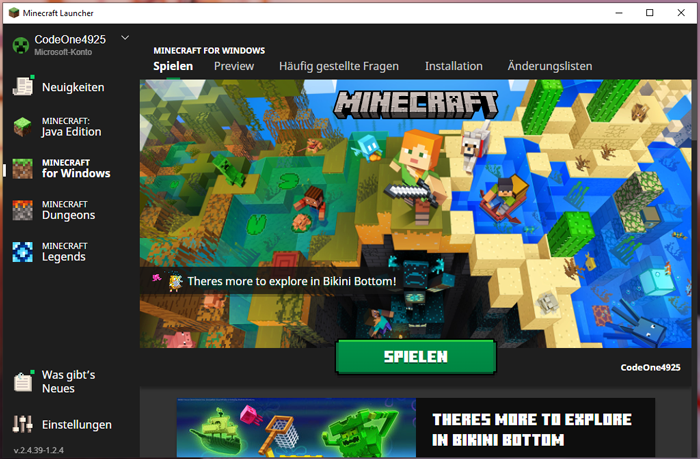

# Überblick
Seit diesem Jahr unterstützt unser Server-Netzwerk nun auch offiziell die **Minecraft Bedrock Edition**.

# Betritt

<figure markdown>
  { width="500" }
  <figcaption>Im Minecraft-Launcher wird links "Minecraft for Windows" ausgewählt. Nach dem Klick auf "Spielen" unten in der Mitte, startet sich nun das eigentliche Spiel.</figcaption>
</figure>

<figure markdown>
  { width="500" }
  <figcaption>Nun befinden wir uns in der Bedrock-Edition von Minecraft. Eventuell wird man links zur Anmeldung mit dem Microsoft-Account aufgefordert. Wenn dies erledigt ist, klickt man auf den großen Button "Spielen".</figcaption>
</figure>

# Account-Synchronisierung
Da grundsätzlich der Bedrock-Account als neuer Account gezählt wird, muss dieser erst mit dem Java-Account verlinkt / synchronisiert werden.

## Lokale Verlinkung
Die "Lokale Verlinkung" meint hiermit die Java-zu-Bedrock-Account Verlinkung ausschließlich auf dem Canstein-Netzwerk.

1. Ausführung als Java-Spieler: `/linkaccount <"Gamer-Tag" = XBOX-Name (mit oder ohne Punkt)>`
   --> Man bekommt im Chat einen Verifierungs-Schlüssel angezeigt.
2. Ausführung als Bedrock-Spieler: `/linkaccount <Java Ingame-Name> <Verifierungs-Schlüssel>`
3. Wenn es funktioniert hat, wird man in der Bedrock vom Server gekickt. Nun kann man auch in der Java Edition wieder den Server verlassen und mit der Bedrock neu joinen. Man wird mit dem Account der Java-Edition repräsentiert.

## Globale Verlinkung
Die "Globale Verlinkung" meint hiermit die Java-zu-Bedrock-Account Verlinkung auf allen Java-Servern, die durch die Software "Geyser" zusätzlichen Bedrock-Support realisiert haben.

Die Verlinkung wird hier genauso wie bei der Lokalen Verlinkung auf dem Server `link.geysermc.org` (jeweils mit dem Standardport; also Port `25565` in Java und `19132` in Bedrock) durchgeführt.

## Aufheben der Verlinkung
Die Verlinkung kann wieder jederzeit mit dem Befehl `/unlinkaccount` aufgehoben werden.

Wenn die ursprüngliche Verlinkung eine Lokale Verlinkung war, muss natürlich der Befehl zum "Unlinken" auch auf dem Canstein-Netzwerk ausgeführt werden. Wenn es eine Globale Verlinkung war, muss der Befehl auf `link.geysermc.org` ausgeführt werden.

# Weitere Befehle
* Java Advancements anzeigen: `/geyser advancements`
* Java Statistiken anzeigen: `/geyser statistics`
* einen Gegenstand in die Off-Hand legen: `/geyser offhand`
* Erweiterte Schnellinfos an/ausschalten: `/geyser tooltips`