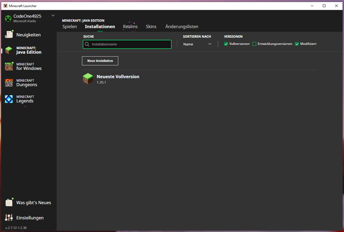
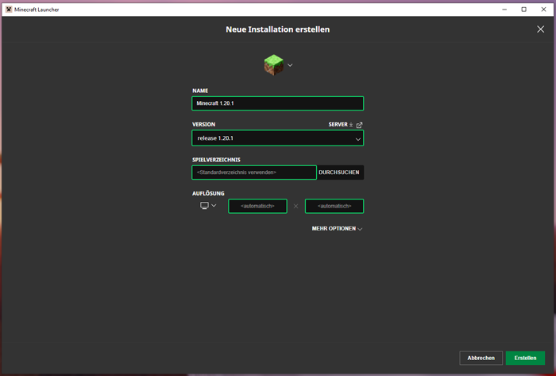
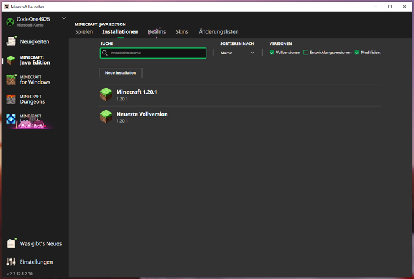
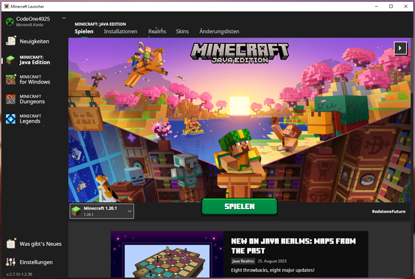
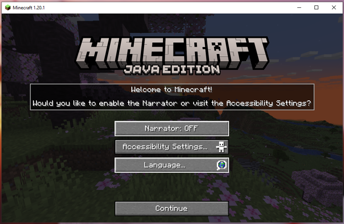
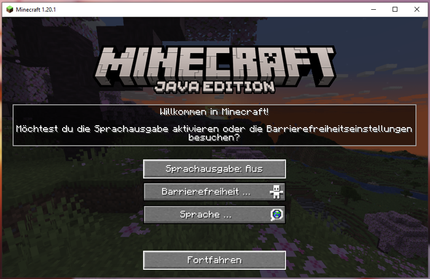
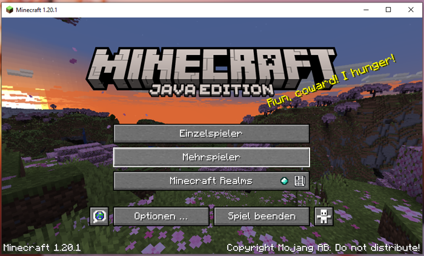
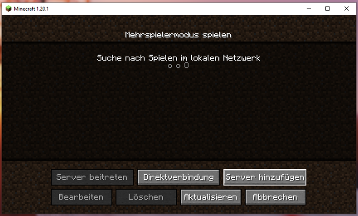
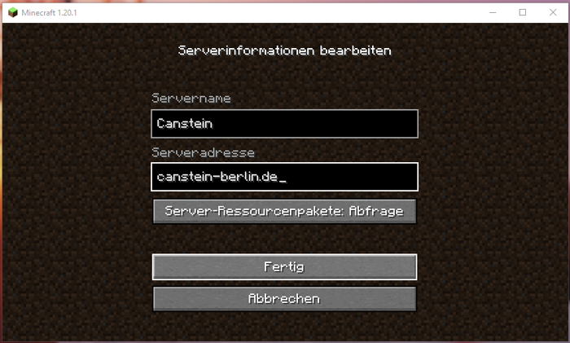
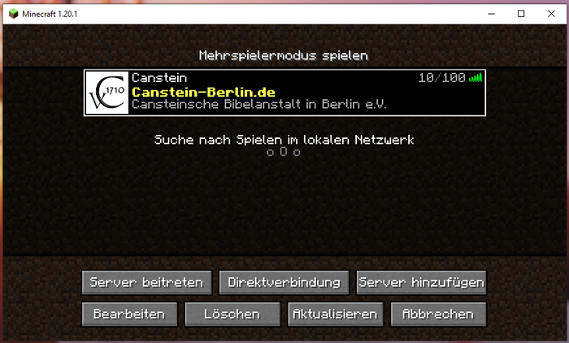

# Server betreten (MC Java)
Unser Server-Netzwerk läuft nativ auf der **Minecraft Java Edition**. Das ist auch das "ursprüngliche" Minecraft-Spiel, dessen Entwicklung am 10. Mai 2009 begann.

## Beitritt

### Beitritt über Windows PC (inkl. Erst-Einrichtung)

#### Schritt 1

Im Minecraft-Launcher wird links "Minecraft: Java Edition" ausgewählt.

Da unser Server-Netzwerk nicht immer sofort mit der "Neusten Vollversion" von Minecraft bespielbar ist, wird nun die Spiel-Installation angepasst. Klicke dafür im oberen Reiter auf "Installationen".

#### Schritt 2

Hier kannst du nun über den Button "Neue Installation" eine neue Spiel-Installation anlegen.

#### Schritt 3

Das Profil-Symbol ganz oben und den "Name" der Installation kann von dir frei gewählt werden.

In der "Version" wählst du die neuste Voll-Version aus, die es gerade gibt. Verzichte aber besser auf den Eintrag "Neuste Vollversion (...)", da dein Profil sonst immer gleich geupdated wird, auch wenn unser Server vielleicht noch nicht so weit ist.

**Tipp:** Wenn du in das Eingabefeld "release" eingibst, werden dir alle verfügbaren Vollversionen angezeigt, die der Minecraft-Launcher kennt.

Die anderen Eingabefelder kannst du ignorieren. Klicke abschließend rechts unten auf "Erstellen".

#### Schritt 4

Um wieder zur üblichen Ansicht zu gelangen, die du bei jedem Launcher-Start sehen wist, klickst du wieder im oberen Reiter auf "Spielen".

#### Schritt 5

Jetzt wählst du links neben dem mittigen "Spielen" Button deine neue Installation aus. Nach dem Klick auf "Spielen" startet sich nun das eigentliche Spiel.

#### Schritt 6

Wenn du das Spiel zum esten Mal mit dieser Installation gestartet hast, wirst du alles auf Englisch vorfinden. Wenn du magst, kannst du die Sprache nun über "Language" anpassen.

Auch entsprechende Barrierefreiheiten lassen sich bereits hier einstellen.

#### Schritt 7

Anschließend kannst du nun auf "Fortfahren" klicken, um die "Ersteinrichtung" abzuschließen.

#### Schritt 8

Du befindest dich nun im Haupt-Menü des Spiels. Über den zweiten Button "Mehrspieler" gelangst du zur Server-Liste.

#### Schritt 9

**Tipp:** Wenn du das erste Mal auf die Mehrspieler Ansicht gehst, wirst du von Mojang auf die Verwendung von Drittanbietern (also den Server) hingewiesen. Lese dir die Info durch und klicke auf "Diesen Hinweis nicht mehr anzeigen", bevor du auf "Fortfahren" klickst.

Die Mehrspieler Ansicht beinhaltet die Server-Liste der von dir abgespeicherten Server. Klicke nun auf "Server hinzufügen".

#### Schritt 10

Hier kann der Wunsch-Server eingetragen werden. In der Zeile "Servername" kannst du einen beliebigen Namen zur Wiedererkennung wählen.

In die Zeile "Serveradresse" muss `canstein-berlin.de` eingetragen werden.

Bestätige abschließend den Server-Eintrag mit dem Button "Fertig".

#### Schritt 11

Nachdem der Server eingetragen wurde, wird er nun in der Server-Liste aufgelistet. Klickt man jetzt (einmal) auf diesen Server-Eintrag, kann man mit den unteren Buttons entsprechende Aktionen mit dem Server-Eintrag durchführen.

Nach dem Klick auf den Button "Server betreten" kommt man schließlich auf unser Server-Netzwerk.