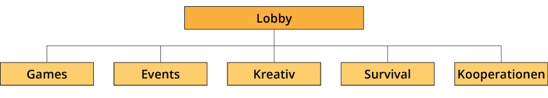

# Server-Übersicht

## Lobby-Server

Der Lobby-Server ist der Eintritts-Punkt auf den Server. Wenn du dich mit dem Server-Netzwerk verbindest, kommst du
immer erstmal auf die Lobby.

Von hier aus kannst du per Befehl auf die anderen Server gelangen. In der Lobby findest du wichtige Informationen
(Regeln, Infos zum Datenschutz, Kontakt-Adressen und Social-Media Adressen, Ränge, ...). Zudem befindet sich in der
Lobby das Gottesdienst-Portal, dass üblicherweise mit Start eines Gottesdiensts geöffnet wird.

## Game-Server

Der Game-Server (zurzeit in der Entwicklung) beinhaltet verschiedene rundenbasierte Minigames zu Gunten der
Abwechslung. Dabei versuchen wir bei einem Teil der Minigames auch theologische Inhalte in die Spiele zu bringen.

Aktuelle Minigames sind:

- Bedwars
- MasterBuilders

## Event-Server

Auf dem Event-Server finden die Gottesdienste statt. Es handelt sich dabei um Grippenspiel-ähnliche immersive
Durchläufe entsprechende entsprechenden Bibelgeschichten. Moderiert wird das ganze von der wissenschaftlichen
Leiterin des Bibellabors _Mareike Witt_ und unserem Pfarrer _Sascha Gebauer_. Mit festlicher Begrüßung, symbolischen
Interaktionen, Fürbitten oder dem abschließenden Vaterunser, wird das ganze Event zu einem vollwertigen Gottesdienst.

## Kreativ-Server

Auf dem Kreativ-Server sind eine vielzahl von Welten verteilt, die mit unterschiedlichen Projekten zusammenhängen.
Es gibt Dauer-Angebote für alle Spieler des Servers, wiederkehrende Bau-Events und einmalige Veranstaltungen für
einen gewissen Zeitraum. Manche Welten werden für ein bestimmtes Projekt verwendet, andere immer wieder genutzt. Die
meisten Bau-Projekte jedoch werden für religiöse Bau-Themen verwendet.

## Survival-Server

Auf dem Survival-Server spielt unsere Minecraft-Community nach Lust und Laune Minecraft im Überlebens-Modus nach dem
üblichen "Freebuild-Prinzip". Es gibt eine normale Oberwelt, einen Nether und das End. Auch sonst ist der Server
recht nahe am Vanilla-Stil gehalten. Der Server wird nicht für didaktische Zwecke verwendet, bleibt also recht
unabhängig von strengen Themen. Es gibt natürlich ein Regelwerk für den Survival-Server, um ein angenehmes
Miteinander zu ermöglichen.

Auf dem Survival-Server ist es möglich, seine Region sichern zu lassen, um "Greefing" zu verhindern und eine gewisse
Fläche sein Eigen nenne zu dürfen. Für die Sicherungen steht den Spielern das Support-Team gerne zur Verfügung.
Durch gesicherte Regionen haben sich mit der Zeit auch ganze Dörfer und Gruppierungen gebildet, in denen die Spieler
in ihrer "Gilde" zusammenbauen und zusammenspielen. Aber auch sonst ist auf dem Server-Netzwerk ein sehr
freundliches Miteinander üblich.

Auch auf dem Survival-Server finden ab und zu kleinere Events statt. Diese werden dann von Teammitgliedern oder
Stammspieler vorbereitet und haben den Spaß-Faktor im Vordergrund.