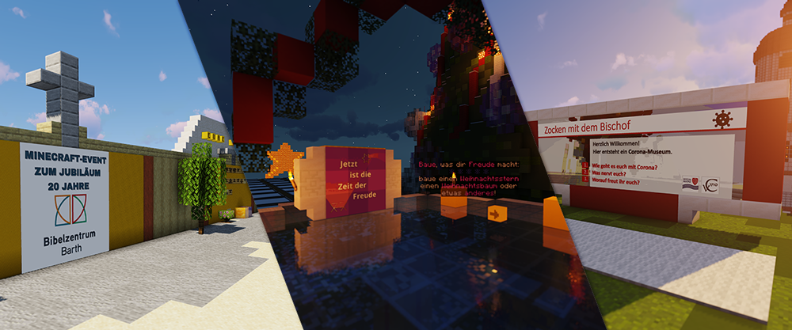

# Unser Angebots-Portfolio - Flexibel und vielseitig

## Über uns

Das Bibellabor der **von Cansteinschen Bibelanstalt in Berlin e.V.** nutzt seit 2019 den Minecraft-Server als mediales Mittel für kirchliche und pädagogische Bildungs-Angebote für Kinder und Jugendliche, sowie für Erwachsenen-Fortbildung im Bereich der Medien-Kompetenz. Wir präsentieren damit neuartige Wege junge Menschen für die Kirche zu begeistern und Videospiele als nützliches didaktisches Mittel einzusetzen.

In all den Jahren hat sich ein Minecraft-Server Team gebildet, dass die Werte des Vereins vertritt und fortlaufend das Potenzial des Minecraft Server-Netzwerks erweitert. Canstein ist bei den Minecraft-Spielern für das Überschreiten von gewohnten Grenzen zwischen Lern-Umgebung, Kirche und digitaler Welt bekannt und möchte auch zukünftig bewährte Ideen ausbauen und Neues wagen.

## Ihr Projekt bei uns im Server-Netzwerk

Wenn Sie mit der Idee spielen für Ihre Kirchengemeinde, Arbeitsgemeinschaft, Schulklasse, Konfi-Gruppe, Verein oder die Teilnehmer einer Veranstaltung eigene Angebote mit **Minecraft** zu entwickeln, können wir Ihnen dabei **beratend zur Seite stehen und einen Platz auf unserem Minecraft-Server anbieten**. Wir haben eine ausgebaute IT-Infrastruktur, eine Vielfalt durchdachter Tools (Sever-Plugins) für den kreativen und moderativen Einsatz, ein fähiges und eingespieltes Support-Team, Mitarbeiter mit jahrelangen Erfahrungen rund um die Leitung von Minecraft-Servern und kurze Kommunikationswege für eine zügige Realisierung Ihrer Ideen. Wir freuen uns immer wieder auf neue Projekte und ein lebendiges Miteinander auf dem Server-Netzwerk.

## Vielfalt unserer Minecraft-Angebote

Mit unserem Minecraft-Server, unserem technischen Setup und unseren Erfahrungen können wir auf die verschiedensten Arten von Anfragen, Wünsche und Bedingungen eingehen. Im Folgenden wollen wir kurz auf die wichtigsten Aspekte unserer Angebote eingehen:

### Dauer des Angebots

- Beratungs-Gespräche
- einmaliges oder regelmäßiges Angebot am Nachmittag
- ein Workshop am Wochenende
- ein Projekt über mehrere Monate hinweg
- eine Kooperation für ein ganzes Jahr
- …

### Analoge, Digitale und Hybride Formen

- Angebote bei Ihnen vor Ort (z.B. Minecraft Bibelbau Workshops zu biblischen Themen, …)
- Angebote bei uns im Bibellabor
- reine Online-Veranstaltungen (Vgl. [Zocken mit dem Bischof](https://bistummainz.de/jugend/thema/jugendprojekt/))
- größere Projekte mit Online- und Offline Anteil (z.B. Minecraft Gottesdienste auf dem Server mit Einbindung der Live-Zuschauer in der Kirche)
- Arbeitsmittel und Medien (Arbeitsblätter, Filme in 2D oder für VR, Bilder, Minecraft-Szenen, …)
- …

### Inhaltliche Ausrichtung

- Theologische Didaktik
- Pädagogische Jugendarbeit
- experimentelle Projekte (z.B. technische Experimente, Machbarkeitsstudien, innovative Projekte, Auseinandersetzen mit neuen medialen Formen, …)
- Kunst-Formen (z.B. biblische Darstellungen in Videospielen, …)
- Informative Angebote zu modernen Themen (z.B. [Klimawandel](https://mine-klima.de), Kirchennutzung, …)
- …

### Zielgruppe

- Kinder oder Jugendliche (Schüler*innen, Konfis)
- Lehrkräfte (insb. aus der Religionslehre, Theologie, Kunst und Informatik), pädagogische Fachkräfte
- Studenten für Pädagogik, Theologie, …
- Gemeinde (Jugendreferat, Pfarrer, …) und andere kirchliche Einrichtungen
- Eltern
- Rentner / Ältere
- …

### Technische Minecraft-Infrastruktur

- vorbereitete interaktive Info-Flächen mit Texte, Bilder etc.
- Grundstücks-Welten (Parzellen-Welten)
- freie Welten zum Bauen und Erkunden (flach, vorgenerierte Natur, vorgebaute Szenen)
- Schau-Flächen mit gebauten Szenen / Strukturen
- vorbereiteter "Role-Play" zum Durchspielen mit einer Story und interaktiven Inhalten
- themen-bezogene Mini-Games und Mikro-Games (z.B. Quiz, …)
- ausgebaute und moderierte Live-Veranstaltungen (z.B. Gottesdienste, …)
- Plattform-übergreifende Veranstaltungen (z.B. via Stream in Twitch, Youtube, Discord, Zoom, …)
- [eigener Bereich auf dem Kooperation-Server](cooperations.md) samt Ränge, Welten, Discord-Channel, Support-Unterstützung etc.
- …

### Finanzielles Budget

Die _von Cansteinsche Bibelanstalt in Berlin e.V._ finanziert sich nur dich Spenden und Aufwandsentschädigungen. Abhängig von Ihrem finanziellen Budget und der potenziellen Wieder-Verwendung der Ergebnisse können wir das Angebot inklusive den Ressourcen (Zeit, Personal, materieller Aufwand, …) und vorbereitende Investitionen entsprechend skalieren.