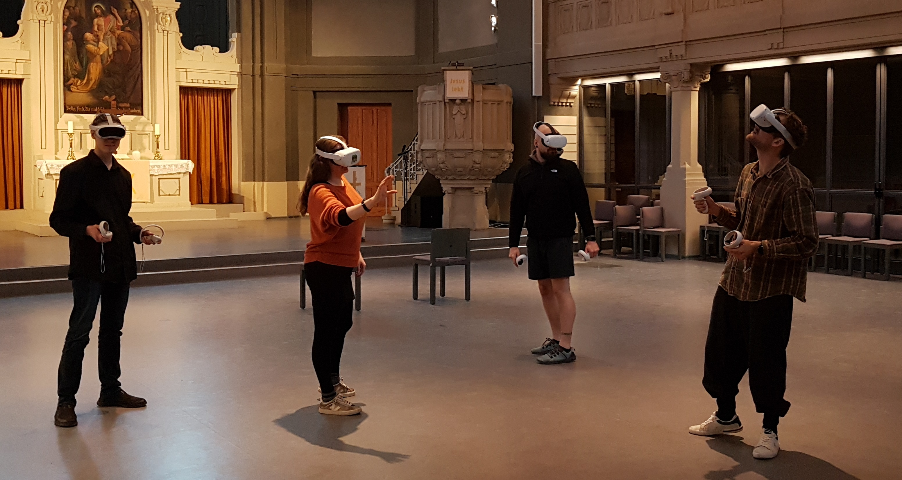

# Virtuelle Realität im Praxis-Test

Seit Anfang 2023 sind wir als Verein im Besitz von insgesamt 11 VR-Brillen. Seitdem testen wir den Einsatz dieser neuen Technik in der Praxis aus, schulen uns selber und stehen als beratende Ansprechpartner für den VR-Einsatz im Religions-Unterricht und anderen Einsatz-Gebieten zur Verfügung. Wir validieren die Benutzer-Erfahrung, die technischen Bedingungen, die Praxis-Tauglichkeit und die Software. Es gibt Stärken und Schwächen bei den aktuellen VR-Brillen und es wird sich zukünftig sicher noch viel in diesem Bereich weiterentwickeln.

## Unsere Geräte

Die VR-Geräte unterscheiden sich von Marke zu Marke und von Modell zu Modell. Jede Marke und jedes Modell bietet ihre eigene Infrastruktur an, hat ihre eigene App-Bibliothek, spezielle technische und physische Eigenschaften und unterscheidet sich auch in der Kompatibilität zu Dritt-Anbieter Software. Aktuell sind wir im Besitz von 5x "Pico 4" und 6x "Meta Quest 2". Durch die zwei verschiedenen Geräte-Typen sind wir flexibler und können abhängig vom Einsatzgebiet das passende Gerät verwenden.

## Technische Möglichkeiten (Mediale Formen)

### Minecraft VR

Ein großer Bestandteil des Bibellabors ist unser _Minecraft_ Angebot. So verwundert es auch sicher wenig, dass wir die VR-Anwendung speziell im Videospiel Minecraft testen.

Auf den VR-Geräten haben wir **Minecraft für VR** anhand von Dritt-Anbieter Software installiert und eingerichtet. Auf jedem VR-Gerät ist ein eigener Minecraft-Account eingerichtet (zurzeit `CansteinVR1` bis `CansteinVR9`), mit dem wir auf unseren Minecraft-Server kommen und die gebauten Welten und Szenen in der VR-Perspektive betrachten und erleben lassen können.

### Andere Spiele

Neben dem bekannten Videospiel ["Beat Saber"](https://beatsaber.com) als Unterhaltungs-Programm für Jugend-Freizeiten gab es auch bereits Kooperations-Projekte, in denen wir unsere VR-Brillen für Veranstaltungen ausgeliehen haben. So wurde in ["Virtual Jerusalem"](https://www.bibelhaus-frankfurt.de/de/ausstellungen/virtual-jerusalem) vom _Bibelhaus Erlebnis Museum in Frankfurt_ ein neues VR-Spiel angeboten, in denen der Zuschauer durch einen digitalen Nachbau von Jerusalem gehen und antike Münzen finden musste. Die VR-Brillen dafür kamen untere anderem von uns.

### 360° Filme und 360° Bilder

Alternativ besteht auch die Möglichkeit 360° Filme über YouTube oder eigene Dateien abspielen zu lassen. Auch 360° Bilder können sich damit angesehen werden.

Auch für Ingame-Aufnahmen in **Minecraft** gibt es spezielle Aufnahme-Software, mit denen Videos für die VR-Darstellung gerendert werden können. Mit diesen Videos lassen sich auch ohne Internet-Verbindung themen-bezogene Minecraft-Kulissen von unserem Minecraft-Netzwerk in VR betrachten.

## Der Reiz von VR-Spielen am Beispiel von Minecraft

Wenn man Minecraft am Computer oder anderen Geräten spielt, sitzt man vor einem rechteckigen Monitor und betrachtet alles etwas "distanziert". Der Reiz von **Minecraft VR** besteht nun darin, dass der Anwender durch die VR-Ansicht wirklich optisch "im Spiel ist". Plötzlich ist ein üblicher Minecraft-Block im Spiel wirklich 1 Meter hoch und auch einer Katze ist plötzlich die zugeschriebene Größe im Spiel anzuerkennen. Man ist richtig _in_ einer Welt, große Gebäude sind wirklich groß und auch Höhenangst kann tatsächlich aufkommen, wenn es unter einem in die Tiefe geht. Es ist spannend zu erkennen, was der Kopf so alles bewirken kann, wenn man ihn optisch richtig austrickst.

Durch die Funktionen der Minecraft VR Anwendung in der Brille und weitere Modifikationen auf unserem Minecraft-Netzwerk, bleibt es auch nicht nur bei optischen Reizen. "Virtual Reality" beschreibt ja das Konzept vollumfänglicher in das Spiel einzutauchen (= "Immersion"), als es normalweise möglich ist. Wenn man sich dreht, dreht man sich auch im Spiel. (Das funktioniert sogar bei den 360° Filmen / Bilder.) Wenn man Minecraft VR im _Stehen_ statt im _Sitzen_ spielt, geht aber noch viel mehr: Springen bewirkt beispielsweise, das man in Minecraft springt. Ducken lässt den Spiel-Avatar in die Hocke gehen, Schwimm-Bewegungen kann unter Wasser sehr hilfreich sein und auch einen Bogen kann man mit der üblichen Handbewegung aufziehen. Durch die VR-Controller an beiden Händen sind diese Bewegungs-Steuerungen optional, aber es wertet das Spielgefühl ungemein auf.

## Potentielle Einsatz-Gebiete für VR

- Immersive Einstiege in nachgebaute virtuelle Szenen / Umgebungen (z.B. Begehungen des Jerusalemer Tempels)
- Erleben von neuen virtuellen Räumen mit informativem, spielerischen, gesellschaftlichen oder geistlichem Fokus
- Perspektiv-Wechsel: Teilnehmer betrachten ihre eigenen Ergebnisse nach dem Bau in VR
- Beratung und Fortbildung über theoretische und praxis-orientierte Anwendung von VR in themen-gezogenen Bereichen
- Entwicklung von MR-Medien für Lern-Mittel, Workshop-Inhalte, Forschungs-Zwecke und Marketing
- VR als engere Schnittstelle zwischen Realität / Vor-Ort Angebote und der Virtualität / Online-Angebote (z.B. Hybride Gottesdienste)
- …